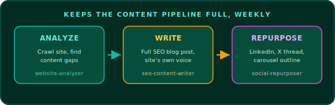

<h1 align="center">Weekly Content Marketing Engine</h1>

<p align="center">
  Keeps a website's content pipeline full automatically.<br/>
  Finds a content gap, writes a full SEO blog post, and repurposes it into social drafts.
</p>

<p align="center">
  
</p>

<p align="center">
  
</p>

<p align="center">
   
</p>
<p align="center">
   
</p>
<p align="center">
   
</p>

## Overview

Keeps a website's content pipeline full automatically. Give it a website URL and a three-stage pipeline crawls the site's latest pages, finds a topic with real SEO potential it hasn't covered, writes a full SEO blog post about it, and repurposes that post into a LinkedIn post, an X thread, and a carousel slide outline. Runs entirely on free, built-in Zo tools — no paid crawling, SEO, or content-generation API required, and it never publishes anything on its own.

## Features

- **`website-analyzer`** — crawls a site's most recent/prominent pages (via sitemap or homepage/blog navigation), then uses web search/research to find content gaps and trending questions in the site's niche, heuristically scored for SEO potential.
- **`seo-content-writer`** — turns the top-ranked topic into a full, publication-ready SEO blog post (title, meta description, H2/H3 body) matched to the site's own voice, backed by real research (no fabricated stats).
- **`social-repurposer`** — repurposes the finished blog post into a LinkedIn post, an X/Twitter thread, and a carousel slide outline, all as draft files.

## Requirements

- Built-in web tools (`web_search`, `web_research`, `x_search`, `read_webpage`, browser tools) — no setup needed.
- No integrations, API keys, or paid subscriptions of any kind.

## Installation

### Fast path (recommended)

1. Open a **new Zo chat**.
2. Paste the entire contents of `installation-prompt.md` from this repo, with the repo URL filled in (it defaults to `https://github.com/robort-gabriel/weekly-content-marketing-engine` — swap it if you're installing from a fork).
3. Send it. The AI will fetch this repo into `Zo-Automations/weekly-content-marketing-engine/` on your Zo, verify the three skills, create a dedicated "Weekly Content Marketing Engine" persona scoped to this project, and ask whether to run the pipeline ad hoc and/or schedule it as a recurring automation — confirming with you before creating anything that runs unsupervised.

This is the whole install: no packages, no build step, no API keys.

### Manual path

If you'd rather install by hand:

1. Clone or download this repo.
2. Copy the whole folder into your Zo workspace at `/home/workspace/Zo-Automations/weekly-content-marketing-engine/`, preserving the structure below. The three skills must stay project-local at `Skills/website-analyzer/`, `Skills/seo-content-writer/`, `Skills/social-repurposer/` — they are not installed globally, and moving them elsewhere breaks the project's scoping.
3. (Optional) In a chat, ask Zo to create a persona for this project using the exact text in `persona.md` so you don't have to restate the pipeline every time.
4. Try it: paste one of the examples from `starter-prompts.md` into a chat.

## Configuration

No secrets required. Per-run parameters, passed stage to stage:

- `website_url` — required (used by `website-analyzer`)
- `focus_topic` — optional, only if you want to skip auto topic-selection and write about a specific angle instead

## Usage

**Ad hoc:** ask for each stage in sequence, or ask for the full pipeline in one request (see `starter-prompts.md`). The stages hand off through files:

```
website-analyzer     -> Content/Website-Content-Engine/<slug>/<date>/site-analysis.md
seo-content-writer    -> blog-post.md
social-repurposer      -> linkedin-post.md, x-thread.md, carousel-outline.md
```

**Recurring:** create a scheduled agent using `automation-prompt.md` as the instructions, with `website_url` filled in and a run frequency (weekly, by design). Scheduling a recurring agent is not done automatically by this project — confirm the frequency and set it up explicitly, since each run is a full Zo session.

**Publishing:** this project only ever writes draft files. Posting the blog post to the live site, or the LinkedIn/X drafts to those platforms, is a separate, explicit step you take yourself — nothing here auto-publishes.

## Folder structure

```
Zo-Automations/weekly-content-marketing-engine/
├── README.md
├── installation-prompt.md            # paste into a new chat to auto-install everything
├── persona.md                        # exact text for the dedicated "Weekly Content Marketing Engine" persona
├── automation-prompt.md              # instructions for the scheduled agent
├── starter-prompts.md                # example prompts
├── assets/
│   ├── pipeline-diagram.svg          # README header pipeline diagram
│   └── zo-logo.png                   # Zo Computer logo used in this README
└── Skills/
    ├── website-analyzer/
    │   └── SKILL.md
    ├── seo-content-writer/
    │   └── SKILL.md
    └── social-repurposer/
        ├── SKILL.md
        └── references/
            └── templates.md          # output file templates
```
</content>
